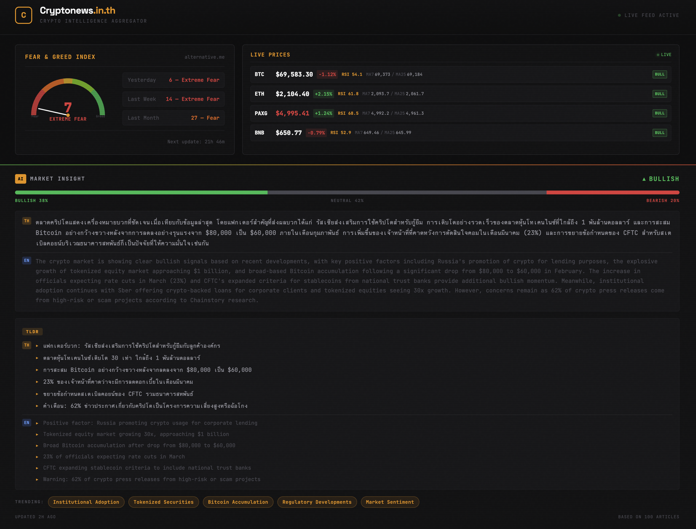

# Cryptonews.in.th

Crypto Intelligence Aggregator — RSS feeds, AI translation/summary, real-time prices, and market insights.



## Features

- **RSS Aggregation** — Auto-fetch from 17+ crypto news sources every 15 minutes
- **AI Translation & Summary** — GLM-4 powered bilingual content (TH/EN)
- **Market Insight** — AI-generated sentiment analysis (bullish/bearish/neutral)
- **Live Prices** — Real-time BTC, ETH, PAXG, BNB with RSI and MA indicators
- **Fear & Greed Index** — Live market sentiment gauge
- **RAG Chat** — Semantic search chatbot with Ollama embeddings
- **SEO Optimized** — Static export with auto-generated sitemap

## Tech Stack

- **Frontend**: Next.js 16 (static export), Tailwind CSS
- **Backend**: Express.js, Socket.IO (real-time updates)
- **Database**: MongoDB / Mongoose
- **AI**: GLM-4 via Z.ai API, Ollama nomic-embed-text (embeddings)
- **Process Manager**: PM2

## Getting Started

### Prerequisites

- Node.js >= 18
- MongoDB (local or remote)
- Ollama with `nomic-embed-text` model (optional, for RAG chat)

### Installation

```bash
git clone git@github.com:Gamezxz/cryptonews.git
cd cryptonews
npm install
```

### Configuration

Copy `.env.example` to `.env` and fill in your values:

```bash
cp .env.example .env
```

```env
MONGODB_URI=mongodb://localhost:27017/cryptonews
PORT=13002
CRON_SCHEDULE=*/15 * * * *
AI_API_KEY=your_api_key_here
AI_BASE_URL=https://api.z.ai/api/coding/paas/v4
ADMIN_KEY=your_admin_key_here
```

### Run

```bash
# Start API server + scheduler + processor
npx pm2 start src/index.js --name cryptonews

# Build static site
npm run build

# Development mode (Next.js)
npm run dev
```

## Architecture

```
config/sources.js       → RSS source configuration
src/index.js            → Express API server (port 13002)
src/fetcher.js          → RSS fetch + AI translation
src/scraper.js          → Full article scraping + AI summary
src/processor.js        → Continuous processing pipeline
src/scheduler.js        → Cron job scheduling
src/insight.js          → AI Market Insight generation
src/chat.js             → RAG chatbot with semantic search
src/embedding.js        → Ollama embedding utilities
app/page.js             → Homepage (static)
app/news/[slug]/page.js → Article detail (SSG)
components/             → React components
```

## License

MIT
